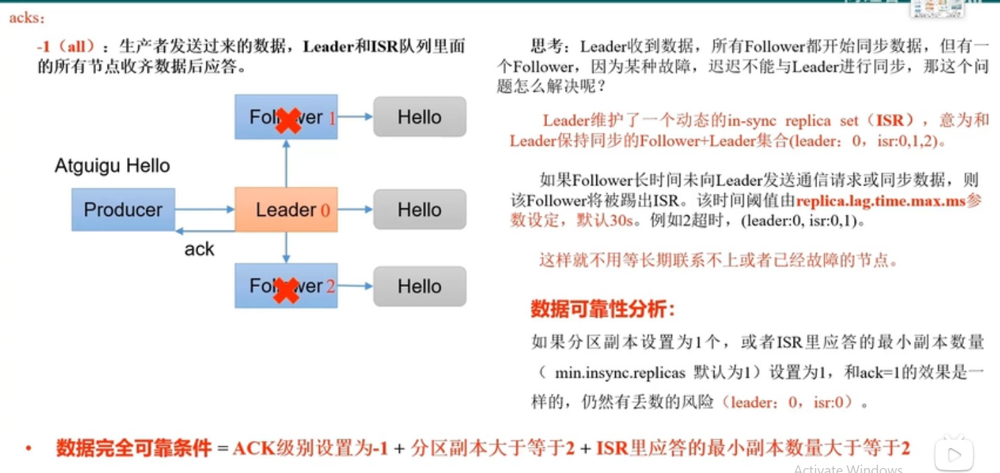
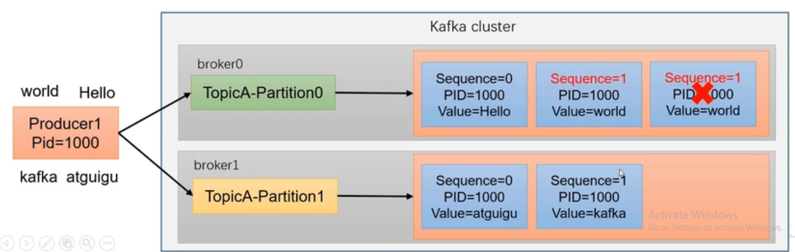
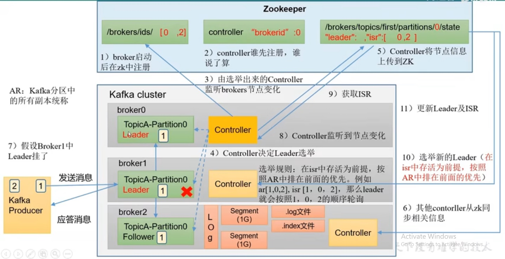

# Kafka
 Kafka是一個基於發佈/訂閱分布式的消息隊列(Message Queue)，主要應用於大數據即時處理。

Kafka是一個開源的分布式事件流平台(Event Streaming Platform)，用於高性能數據管道、資料流分析、數據集成和關鍵任務應用。

 發佈/訂閱: 消息的發佈者不會將消息直接發送給特定的訂閱者，而是將發佈的消息分為不同的類別，訂閱者只接收感興趣的消息。

## 基本概念

* Message Queue
    * 緩衝/削峰: 有助於控制和優化數據流經過系統的速度，解決生產/消費訊息的處理速度不一致的情況。

    * 解耦: 允許獨立擴展或修改兩邊的處理過程，只要確保它們遵守同樣的接口。

    * 異步通信: 允許使用者將message放入queue中，但不立即處理它，等到需要時才進行處理。


Message Queue的兩種模式:
* 點對點模式: Consumer主動拉取數據，消息收到後清除


* 發佈/訂閱模式
    * 可以有多個topic(主題)
    * Consumer消費數據之後不刪除數據
    * 每個Consumer相互獨立，都可以消費到數據


### 基礎架構
1. 為方便擴展並提高吞吐量，一個topic分為多個partition
2. 配合分區的設計，提出Consumer Group的概念，群組內每個消費者平行消費
3. 為提高可用性，替每個partition增加副本，類似NameNode HA
4. Zookeeper中記錄誰是Leader，Kafka 2.8.0後也可以配置不採用ZK


#### server.properties
* broker.id: 唯一標識，不能重複
* log.dirs: log輸出位置
* zookeeper.connect: zookerper connect string，例如"hadoop102:2181,hapoop103:2181,hadoop104:2181/kafka"

### kafka-topics.sh
* --boostrap: 連接的kafka broker主機名稱和Port
* --topic: 操作的topic名稱
* --create: 創建topic
* --delete: 刪除topic
* --alter: 修改topic
* --list: 查看所有topic
* --describe: 查看topic詳細描述
* --partitions: 設置分區數
* --replication-factor: 設置分區副本
* --config: 更新系統默認的配置

## Kafka Producer
異步:


同步:

### 分區好處
1. 合理使用儲存資源: 每個Partition在一個Broker上儲存，可以把海量的數據按照分區切割成一塊一塊儲存在多台Broker上。合理控制分區的任務，可以達成附載均衡的效果。
2. 提高平行度，Producer可以以分區為單位發送數據，消費者可以以分區為單位消費數據。

#### DefaultPartitioner — Default Partitioning Strategy
* if a partition is specified in the record, user it.
* if no partition is specified but key is present choose a partition based on a hash of the key.
* if no partition or key is present choose the sticky partition that changes when the batch is full. See KIP-480 for details about sticky partitioning.

* DefaultPartitioner is a Partitioner that uses a 32-bit murmur2 hash to compute the partition for a record (with the key defined) or chooses a partition in a round-robin fashion (per the available partitions of the topic).

* DefaultPartitioner is the default partitioning strategy (per ProducerConfig.PARTITIONER_CLASS_CONFIG configuration property).

* DefaultPartitioner is a Configurable that needs no configuration while being created.

* DefaultPartitioner does nothing when requested to close.

(1) 指明partition的情況下，直接講指定值作為Partition值，例如partition=0，所有數據寫入分區0
(2) 沒有指明partition值但有key值的情況下，將key的hash值與topic的partition數進行取餘得到partition值，例如key1的hash值=5，key2的hash值=6，topic的partition數=2，那麼key1對應的value1寫入分區1，key2對應的value2寫入分區0
(3) 既沒有partition值又沒有key值的情況下，kafka採用Sticky Partition(黏性分區器)，會隨機選擇一個分區，並盡可能一直使用該分區，等到該分區的batch已滿或者已完成，kafka再隨機選擇一個分區使用(和上一次的不同)。例如第一次隨機選擇0號分區，等0號分區當前的batch滿了或者linger.ms設置的時間到，Kafka再隨機一個分區進行使用(如果還是0會繼續隨機)

### 提高吞吐量
* batch.size
* linger.ms: 等待時間，修改為5-100ms(會有延遲，要注意)
* compression.type: 壓縮snappy
* RecordAccumulator:緩衝區大小，修改為64m

### ack
* acks=0: Producer發送數據後就不管，可靠性差但效率高
* acks=1: Producer發送數據後Leader回應，可靠性中等，效率中等
* acks=-1: Producer發送數據後Leader和ISR隊列裡面所有Follower回應，可靠性高但效率低(有可能數據重複，當更換Leader時又重傳一次給下一個Leader，就是本來的follower之一)

! 在生產環境中，acks=0很少使用，acks=1一般用於傳送普通日誌，能允許丟個別數據，acks=-1一般用於傳輸重要數據，用於對可靠性要求比較高的場景。



### 數據傳遞
* 至少一次(At Least Once): ACK為-1 + 分區副本>=2 + ISR裡面回應的最小副本數量>=2，可以保證數據不丟失，但不能保證數據不重複。
* 最多一次(At Most Once): ACK為0，可以保證數據不重複，不能保證數據不丟失。
* 精確一次(Exactly Once): 冪等性 + 至少一次。對於重要的訊息，不能重複也不能丟失。

### 冪等性原理
冪等性就是指Producer不論向Broker發送多少次重複數據，Broker端都只會持久化一條，保證不重複。

重複數據的判斷標準: 具有<PID, Partition, SeqNumber>相同主鍵的訊息提交時，Broker只會持久化一條。其中PID是Kafka每次重啟都會分配一個新的、Partition表示分區號、Sequence Number是單調自增的。所以冪等性只能保證的是在單分區單Session內不重複。

!使用冪等性開啟參數enable.idempotence默認為true，false關閉


### Producer事務

### 數據排序
* 單分區內有序(有條件的)
* 多分區: 分區與分區間內無序，多分區要排序要到Consumer後透過其他Spark之類的進行排序，但要等分區數據都收到才能做(有效率問題)

單分區有序
* 未開啟冪等性: max.in.flight.requests.per.connection要設置成1。
* 開啟冪等性: max.in.flight.requests.per.connection要設置成<=5。

因為啟用冪等性後，kafka服務端會緩存producer發送的最近五個request的元數據，故無論如何都可以保證最近5個request的數據都是有序的。


## kafka Broker

### 流程
1. broker啟動後在zookeeper中註冊(/borker/ids/)
2. controller誰先註冊誰說了算(/controller)
3. 由選舉出來的Controller監聽brokers節點變化
4. Controller決定Leader選舉
    * AR: Kafka分區中的所有副本統稱
    * 選舉規則: 在isr中存活為前提，按照AR中排在前面的優先。例如ar[1,0,2]、isr[1,0,2]，那麼Leader就會按照1,0,2的順序輪流詢問
5. Controller將節點資訊上傳到ZooKeeper(/brokers/topics/first/partitions/0/state)
6. 其他Controller從ZooKeeper同步相關資訊
7. 假設Broker1中的Leader死掉
8. 透過3的監控，Controller監聽到節點變化
9. 從Zookeeper中獲取ISR資訊
10. 選舉新的Leader
11. 更新Leader及ISR



#### ZooKeeper
工具:PrettyZoo

1. /kafka/brokers/ids: 紀錄有哪些server
2. /kafka/brokers/topics/first/partitions/0/state: 記錄誰是Leader，有哪些server可用
3. /kafka/controller: 輔助選舉Leader

### 節點的服役/退役

#### 加入新節點服役
1. Create New Server
2. 修改IP地址: /etc/sysconfig/network-scripts/ifcfg
3. rm -rf /bin/datas & logs (if server was cloned)
4. 更改server.properties的broker id並啟動Server
5. 創建一個需要均衡的topic
```json
{
    "topics": [
        {"topic": "first"}
    ],

    "version": 1
}
```
6. 產生負載均衡計畫 bin/kakfa-reassign-partitions.sh
```bash
bin/kafka-reassign-partitions.sh --bootstrap-server xx:9092 --topics-to-move-json-file topics-to-move.json --broker-list "0,1,2,3" --generate
```
7. 創建副本儲存計畫，把上面步驟6生成的計畫寫入
8. 執行副本儲存計畫
```bash
bin/kafka-reassign-partitions.sh --bootstrap-server xx:9092 --reassignment-json-file increase-replication-factor.json --execute
```
9. 驗證儲存計畫
```bash
bin/kafka-reassign-partitions.sh --bootstrap-server xx:9092 --reassignment-json-file increase-replication-factor.json --verify
```

#### 移除節點退役
1. 創建一個要均衡的topic
```json
{
    "topics": [
        {"topic": "first"}
    ],

    "version": 1
}
```
2. 產生負載均衡計畫 bin/kakfa-reassign-partitions.sh
```bash
bin/kafka-reassign-partitions.sh --bootstrap-server xx:9092 --topics-to-move-json-file topics-to-move.json --broker-list "0,1,2" --generate
```
3. 創建副本儲存計畫，把上面步驟2生成的計畫寫入
4. 執行副本儲存計畫
```bash
bin/kafka-reassign-partitions.sh --bootstrap-server xx:9092 --reassignment-json-file increase-replication-factor.json --execute
```
5. 驗證儲存計畫
```bash
bin/kafka-reassign-partitions.sh --bootstrap-server xx:9092 --reassignment-json-file increase-replication-factor.json --verify
```
6. Stop Server 
```bash
bin/kafka-server-stop.sh
```

### Kafka副本

#### 基本概念
1. 副本作用: 提高數據可靠性。
2. Kafka默認副本1個，生產環境一般配置為2個，保證數據可靠性。太多副本會增加儲存空間，增加網路上數據傳輸，將低效率。
3. Kafka副本分為Leader和Follower，Kafka Producer只會把數據發送至Leader，然後Follower找Leader進行同步。
4. Kafka分區中所有副本統稱為AR(Assigned Repilicas)。
    * AR = ISR + OSR
    * ISR: 和Leader保持同步的Follower集合。如果Follower長時間未向Leader發送通信請求或同步數據，則該Follower將被踢出ISR。該時間閥值由replica.lag.time.max.ms參數設定，默認為30s。Leader發生故障後，會從ISR中選出新的Leader。
    * OSR: 表示Follower與Leader副本同步時，延遲過多的副本。

#### Leader選舉流程
Kafka集群中有一個broker的Controller會被選舉為Controller Leader，負責管理集群broker的上下線、所有topic的分區副本分配和Leader選舉等工作。

#### Follower & Leader 故障處理
* LEO(Log End Offset): 每個副本的最後一個offset，LEO其實就是最新的offset + 1。
* HW(High Watermark): 所有副本最小的LEO。

Follower故障
1. Follower發生故障後會被臨時踢出ISR
2. 這個期間Leader和Follower繼續接收數據
3. 待該Follower恢復後，Follower會讀取本地磁盤紀錄上次的HW，並將log文件高於HW的部分截取掉，從HW開始向Leader進行同步。
4. 等該Follower的LEO>=該Partition的HW，即Follower追上Leader後就可以重新加入ISR。


Leader故障處理
1. Leader發生故障之後，會從ISR選出一個新的Leader
2. 為保證多個副本之間的數據一致性，其餘的Follower會先將各自的log文件高於HW的部分截掉，然後從新的Leader同步數據。


! 這只能保證副本之間的數據一致性，並不能保證數據不丟失或不重複。

#### 分區副本分配
第N輪就錯開N位

#### Leader Partition負載平衡
正常情況下，Kafka本身會自動把Leader Partition均勻分散在各個機器上，來保證每台機器的讀寫吞吐量都是均勻的。但是如果某些broker當機，會導致Leader Partition過於集中在其他少部分幾台的broker上，這會導致少數幾台broker的讀寫請求壓力過高，其他當機的broker重啟後都是follower partition，讀寫請求很低，造成集群負載不均衡。


* auto.leader.rebalance.enable: 默認是true，自動leader partition平衡(建議False，rebalance很吃效能，如果要開建議把比率拉高)
* leader.imbalance.per.broker.percentage: 默認是10%。每個broker允許不平衡的比率。如果每個broker超過了這個值，控制器會觸發leader的平衡。
* leader.imbalance.check.interval.seconds: 默認是300s，檢查leader負載是否平衡的間隔時間。

#### 增加副本因子

1. 創建topic
```bash
bin/kafka-topics.sh --bootstrap-server xx:9092 --create --partitions 3 --replication-factor 1 --topic four
```

2. 手動增加副本
    * 創建副本儲存計畫
    * 執行副本儲存計畫

#### 文件儲存機制
Topic是邏輯上的概念，Partition是物理上的概念，每個partition對應於一個log文件，該log文件中儲存的就是Producer生產的數據。Producer產生的數據會被不斷追加到該log文件末端，為防止log文件過大導致數據定位效率低下，Kafka採取了分片和索引機制，將每個partition分為多個segment(預設1G)。每個segment包括: ".index文件"、".log文件"、".timeindex文件"等。這些文件位於一個資料夾下，該資料夾的命名規則為: topic名稱+分區號碼，例如first-0。

* .log: 日誌文件(實際上的數據)
* .index: 偏移量索引文件
* .timeindex: 時間戳索引文件
* 其他文件


透過工具查看index文件
```bash
./kafka-run-class.sh kafka.tools.DumpLogSegments --files /tmp/kafka-logs/quickstart-events-0/00000000000000000000.index

result:
(相對的)offset: 0 position: 0
```

* index為**稀疏索引**，大約每往log文件寫入4kb數據才會往index文件寫入一條索引。參數log.index.interval.bytes默認為4kb。
* index文件中保存的offset為相對offset，這樣能確保offset的值所佔空間不會過大，因此能將offset的值控制在固定大小。

如何在log文件中定位到offset=x的Record?
1. 根據目標offset定位Segment文件
2. 找到<=目標offset的最大offset對應的索引項
3. 定位到log文件
4. 向下遍歷找到目標Record

透過工具查看log文件
```bash
./kafka-run-class.sh kafka.tools.DumpLogSegments --files /tmp/kafka-logs/quickstart-events-0/00000000000000000000.log

result:
baseOffset: 25 lastOffset: 25 count: 1 baseSequence: 25 lastSequence: 25 producerId: 0 producerEpoch: 0 partitionLeaderEpoch: 0 isTransactional: false isControl: false deleteHorizonMs: OptionalLong.empty position: 773 CreateTime: 1660291786300 size: 72 magic: 2 compresscodec: none crc: 4213431114 isvalid: true
```

#### 文件清理策略
Kafka中默認的日誌保存時間為7天，可以透過調整參數修改保存時間。
* log.retention.hours: 最低優先級小時，默認7天
* log.retention.minutes: 分鐘
* log.retention.ms: 最高優先級毫秒
* log.retention.check.interval.ms: 檢查週期，默認為5分鐘

一旦日誌超過了設置的時間，Kafka會清理日誌，日誌清理策略有delete和compact兩種。
1. delete日誌刪除: 將過期數據刪除
    * log.cleanup.policy=delete 所有數據啟用刪除策略
        * 基於時間: 默認打開。以segment中所有紀錄中的最大時間戳作為該文件時間戳。
        * 基於大小: 默認關閉。超過設置的所有日誌總大小，刪除最早的segment。log.retention.bytes默認為-1，表示無限大。

Q:如果一個segment中有一部分數據過期，一部分沒有過期，怎麼處理?
A:在基於時間的情況下，以最大時間戳為主，該文件的最大時間戳是未過期的文件。

2. compact日誌壓縮
對於相同key的不同value值，只保留最後一個版本。
    * log.cleanup.policy=compact 所有數據啟用壓縮策略

    * 壓縮後的offset可能是不連續的，比如上圖中沒有6，從這些offset消費訊息時，將會拿到比這個offset大的offset對應的消息，實際上會拿到offset為7的訊息，並從這個位置開始消費。
    * 這種策略只適合特殊場景，像是訊息的key是user id，value是使用者的資料，通過這種壓縮策略，整個訊息集合裡就保存了所有user最新的資料。

#### 高效讀取數據
* Kafka本身是分布式集群，可以採用分區技術，平行度高。
* 讀數據採用稀疏索引，可以快速定位要消費的數據。
* 依序寫入磁盤: Kafka的producer產生數據要寫入到log文件中，寫入的過程是一直追加到文件末端，依序寫入。官網有數據表明同樣的磁盤，依序寫入可以達到600M/s，而隨機寫入只有100K/s。這與磁盤的機械架構有關，依序寫入之所以快ˋ因為省去了大量磁頭尋址的時間。
* PageCache + 零拷貝技術
    * 零拷貝: Kafka的數據加工處理交由Kafka Producer和Kafka Consumer處理。Kafka Broker應用層不關心儲存的數據，所以就不用走應用層，傳輸效率高。
    * PageCache: Kafka重度依賴底層操作系統提供的PageCache功能。當上層有寫入操作時間，操作系統只是將數據寫入PageCache。當讀取操作發生時，先從PageCache查找，如果找不到再去磁盤中讀取。實際上PageCache是把盡可能多出的閒置memory當作磁盤緩存使用。

## Kafka Consumer

### Kafka消費方式
* pull: Consumer採用從broker主動拉取數據。(預設)

* push: Kafka沒有採用這種方式，因為由broker決定訊息的發送速率很難適應所有Consumer的消費速率。例如推送的速度固定為50m/s，處理速度不到50m/s的Consumer就來不及處理訊息。

! pull模式不足之處是，如果Kafka沒有數據，Consumer可能會陷入循環中，一直返回空數據。

### Consumer工作流程


### Consumer Group
消費者組: 由多個Consumer組成。形成一個消費者組的條件是所有消費者的groupid相同。
* 消費者組內每個消費者負責消費不同分區的數據，一個分區只能由一個組內消費者消費。
* 消費者組之間互不影響。所有的消費者都屬於某個消費者組，即消費者組是邏輯上的一個訂閱者。
* 如果消費者組內的消費者數量>topic分區數量，則有一部分的消費者就會閒置，不會接收任何訊息。


### Consumer Group Flow


### Consumer消費
#### 消費topic
1. 需求: 創建一個獨立消費者，消費topic中數據。要注意在Consumer API中必須配置Consumer Group ID。命令列啟動消費者不填寫則會被自動填寫隨機的Consumer Group ID。

#### 消費分區
#### 消費者組

### 分區分配以及再平衡
1. 一個consumer group中由多個consumer組成，一個topic有多個partition組成，那由哪個consumer消費哪個partition的數據?
2. Kafka有四種主流的分區分配策略: Range、RoundRobin、Sticky、CooperativeSticky。可以透過配置參數patition.assignment.strategy，修改分區的分配策略。默認策略是Range + CooperativeSticky。Kafka可以同時使用多個分區分配策略。

分區策略
* Range

觸發再平衡會將數據直接全部給其他人，ex: consumer0掛掉0,1,2會直接給consumer1

* RoundRobin

觸發再平衡同樣數據採用輪詢方式，ex: consumer1掛掉，consumer2變成0,1,4,6，consumer3變成2,3,5

* Sticky
黏性分區定義: 可以理解為分配的結果帶有黏性的。即在執行新一次的分配之前，考慮上一次分配的結果，盡量減少調整分配的變動，節省大量的成本。

首先會盡量均衡的放置分區到消費者上面，在出現同一消費者組內消費者出現問題的時候，會盡量保持原有分配的分區不變化。

### Offset
Consumer默認將offset紀錄在_consumer_offsets主題內，採用key & value的方式儲存數據。Key是groupid + topic + 分區號碼，value就是當前offset值。每隔一段時間，kafka內部會對這個topic進行compact，也就是每個group.id + topic + 分區號碼就保留最新數據。 

在kafka0.9之前，consumer默認將offset保存在zookeeper中，但會帶來大量的網路通訊降低效能。

1. 想看系統主題要在config/consumer.perperties中添加配置exclude.internal.topics=false，默認是true表示不能消費系統主題
2. 創建topic
3. 發送數據至創建的topic
4. 啟動Consumer消費對應的topic
5. 查看消費者主題_consumer_offsets
```bash
 bin/kafka-simple-consumer-shell.sh --topic __consumer_offsets --partition 32 --bootstrap-server xx:9092 --consumer.config config/consumer.properties --formatter "kafka.coordinator.group.GroupMetadataManager\$OffsetsMessageFormatter" --from-beginning
```

#### 自動提交offset
kafka提供了自動提交offset的功能。
自動提交offset的相關參數:
* enable.auto.commit: 是否開啟自動提交offset功能，默認是true
* auto.commit.interval.ms: 自動提交offset的時間間隔，默認是5s


#### 手動提交offset
雖然自動提交offset簡單方便，但由於是基於時間提交的，開發人員難以掌握offset提交的時機，因此Kafka還提供了手動提交offset的API。

手動提交offset的方法有兩種:分別是commitSync(同步提交)和commitAsync(異步提交)。兩者相同點是都會將本次提交的一批數據最高的偏移量提交，不同點是同步提交阻塞當前線程，一直到提交成功，並且會自動失敗重試(由不可控因素導致，也會出現提交失敗)，而異步提交則沒有失敗重試機制，故有可能**提交失敗**。

* commitSync(同步提交): 必須等待offset提交完畢，在去消費下一批數據。
* commitAsync(異步提交): 發送完提交offset請求後，就開始消費下一批數據。

使用上先將自動提交關閉，然後call sync or async API。

#### 指定offset消費
auto.offset.reset = earliest | latest | none 默認是latest

當Kafka中沒有初始偏移量(消費者組第一次消費)或Server上不存在當前偏移量時(該數據被刪除)，該怎麼做?
1. earliest: 自動將偏移量重置為最早的偏移量，--from-beginning。
2. latest(默認值): 自動將偏移量重置為最新偏移量。
3. none: 如果未找到消費者組的先前偏移量，則向消費者拋出異常。

#### 指定時間消費
將時間轉換成offset，再按照offset消費

### 消費者事務


如果想完成Consumer端的精準一次性消費，那麼需要Kafka消費端將消費過程和提交offset過程做原子綁定。此時需要將Kafka的offset保存到支持事務的自定義媒介(EX:MySQL)

### 數據積壓(Consumer增加吞吐量)
1. 如果是Kafka消費能力不足，則可以考慮增加Topic的分區數，並且同時提升消費組的消費者數量，消費者數=分區數。
2. 如果是下游的數據處理不及時: 提高每批次拉取的數量。批次拉取數據過少(拉取數據/處理時間 < 生產速度)，使處理的數據小於生產的數據，也會造成數據積壓。

## Kafka-Eagle監控
1. intsall MySQL
2. 準備Kafka環境準備，在bin/kafka-server-start.sh內更改內存大小(默認1G)
3. install kafka-eagle，修改系統配置(/bin/system-config.properties)
    * efak.zk.cluster.alias: 監控集群數量
    * cluster1.zk.list: 監控的node，hadoop102:2181,hadoop103:2181,hadoop104:2181/kafka
    * cluster1.efak.offset.storage: 儲存位置，可拿掉zookeeper
    * efak.driver=com.mysql.jdbc.Driver
    * efak.url="jdbc:mysql://xx"
    * efak.username
    * efak.password
4. 配置Kafka-eagle環境變量
5. 啟動kafka集群 & efak(kafka-eagle)


## Kafka-Kraft模式

### Kafka-Kraft架構
Kafka模式不再依賴Zookeeper集群，而是用三台controller節點代替zookeeper，元數據保存在controller中，由controller直接進行Kafka集群管理。

優點:
* Kafka不再依賴外部框架，能夠獨立運行
* Controller管理集群時，不再需要從zookeeper中先讀取數據，集群性能上升
* 由於不依賴zookeeper，集群擴展時不再受到zookeeper讀寫能力限制
* Controller不再動態選舉，而是由配置文件規定。這樣我們可以有針對性的加強controller節點的配置，而不是像以前一樣對隨機controller節點的高負載束手無策

### Kafka-Kraft集群部屬
1. 配置conf/kraft/server.properties
    * process.roles: 配置node的角色
    * node.id
    * controller.quorum.voters: 選舉配置
    * advertised.listeners: 對外地址(不同台要改)
2. 啟動集群(不能像是zk直接啟動)，要先初始化
3. 初始化集群數據目錄
    * 生成儲存目錄唯一ID
    ```bash
    bin/kafka-storage.sh random-uuid
    ```

    * 用該ID格式化kafka儲存目錄(根據節點數量)
    ```bash
    /bin/kafka-storage.sh format -t uuid -c /kafka/config/kraft/serber.properties
    ```
4. 啟動集群
```bash
bin/kafka-server-start.sh -daemon config/kraft/server.properties
```

## Kafka與Flume整合

### Flume Consumer
1. 啟動kafka集群
2. 啟動Kafka Consumer
3. 安裝Flume(修改日誌輸出位置)
4. 寫Flume配置文件
5. 啟動Flume
```bash
bin/flume-ng agent -c conf/ -n a1 -f jobs/file_to_kafka.conf &
```

### Flume Producer
1. 啟動kafka集群
2. 啟動Flume
```bash
bin/flume-ng agent -c conf/ -n a1 -f jobs/file_to_kafka.conf -Dflume.root.logger=INFO,console
```
3. 啟動kafka Producer
4. Check console log

## Kafka與Flink整合

## Kafka與Fluentd整合
以蒐集k8s log為例
```yaml
apiVersion: v1
kind: ConfigMap
metadata:
  name: fluentd-conf-configmap
  namespace: fluentd-test
data:
  fluentd.conf: |
    <source>
      @type tail
      path /var/log/containers/*.log
      pos_file /var/log/fluentd/fluentd-containers.log.pos
      tag *.*
      read_from_head true
      <parse>
        @type cri
        merge_cri_fields false
      </parse>
    </source>
    <filter *.**>
      @type record_transformer
      <record>
        filename ${tag_suffix[3]}
      </record>
    </filter>
    <match *.**>
      @type kafka2
      brokers x.x.x.x:9092
      <buffer topic>
        @type file
        path /var/log/td-agent/buffer/td
        flush_interval 3s
      </buffer>
      <format>
        @type json
      </format>
    topic_key topic
    default_topic test
    required_acks -1
    </match>
---
apiVersion: v1
kind: Pod
metadata:
  name: fluentd
  namespace: fluentd-test
  labels:
    k8s-app: fluentd-logging
    version: v1
spec:
  containers:
  - name: fluentd
    image: docker.io/fluent/fluentd-kubernetes-daemonset:v1.15.3-debian-kafka2-amd64-1.0
    imagePullPolicy: IfNotPresent
    env:
    - name: FLUENTD_CONF
      value: "fluentd.conf"
    resources:
      limits:
        memory: 200Mi
      requests:
        cpu: 100m
        memory: 200Mi
    volumeMounts:
    - name: varlog
      mountPath: /var/log/containers
    - name: dockercontainerlogdirectory
      mountPath: /var/log/pods
      readOnly: true
    - name: fluentd-conf
      mountPath: /fluentd/etc
  terminationGracePeriodSeconds: 30
  tolerations:
  - operator: "Exists"
  volumes:
  - name: varlog
    hostPath:
      path: /var/log/containers
  - name: dockercontainerlogdirectory
    hostPath:
      path: /var/log/pods
  - name: fluentd-conf
    configMap:
      name: fluentd-conf-configmap
```
## Kafka與Spark整合

## Kafka優化

### 硬體選擇
```bash
100萬個job * 每個每天產生100條日誌 = 1 億條
處理日誌速度 1億條 / (24 * 3600s) = 1150條/s
1條日誌(0.5K ~ 2k)
1150條* 1k/s = 1m/s

高峰值 (中午8-12): 1m/s *20 = 20m/s ~ 40m/s

需要多少server

server數量 = 2 * (生產者峰值生產速率 * 副本數 / 100) + 1
= 2 * (20/ms * 2 / 100) + 1
= 3 台

硬碟選擇:
    Kafka按照順序讀寫 HDD & SSD順序讀寫速度差不多
1億條 * 1k = 100g
100g * 2個副本 * 3天 / 0.7 = 1t
3台server的 disk size > 1t

記憶體選擇:
    kafka memory = heap memory(Kafka內部配置) + PageCache(server memory)
    heap memory 10 ~ 15G 
    查看
    1. jps get id
    2. jstat -gc id ls 10 看YGC使用次數
    memory使用率
    jmap heap id

    PageCache: segment(1g) (分區數Leader(10) * 1g *25% ) / 3 = 1g
CPU選擇:
    * num.io.threads=8 負責寫disk的線程數，整個參數值要占總核的50%。
    * num.replica.fetchers = 1 副本拉取線程數，占總核的1/3。
    * num.network.threads=3 數據傳輸線程數，占總核的2/3。
    建議32個CPU core
網路選擇:
    網路頻寬 = 峰值吞吐量
```

### Producer優化
* buffer.memory: RecordAccumulator緩衝區總大小，默認32m，可以改到64m
* batch.size: 緩衝區一批數據最大值，默認16k。適當增加該值，可以提高吞吐量，但是如果該值設置太大，會導致數據傳輸延遲增加。可以改到32k
* linger.ms: 如果數據未達到batch.size，sender等待linger.time之後就會發送數據。默認值是0ms，表示沒有延遲。生產環境建議該值大小5-100ms。
* compression.type: Producer發送所有數據的壓縮方式。默認是none，也就是不壓縮。支持壓縮類型: none、gzip、snappy、lz4和zstd

### Broker優化
* auto.leader.rebalance.enable: 默認是true。自動Leader Partition平衡，建議關閉。
* log.retention.hours: Kafka中數據保存的時間，默認7天。
* auto.create.topic.enable: 當topic不存在寫入數據時自動創建topic，默認為true。建議設置為false，避免造成維運困難。

### Consumer優化

### Kafka整體優化
1. 提高生產吞吐量
    * buffer.memory: 發送訊息的緩衝區大小，默認是32m，可以增加到64m
    * batch.size: 默認是16k。如果batch設置太小，會導致頻繁網路請求，吞吐量下降。如果batch太大，會導致一條訊息需要等待很久才能被發送出去，增加網路延遲。
    * linger.ms: 默認值是0。意思就是消息必須立即發送。一般設置一個5-100ms。如果linger.ms設置的太小，會導致頻繁網路請求，吞吐量下降。如果linger.ms太長，會導致一條消息需要等待很久才能被發送出去，增加網路延遲。
    * compression.type: 默認是none，不壓縮，也可以採用lz4壓縮，效率不錯且可以減少數據輛，提升吞吐量，但會加大producer端的CPU開銷。
2. 增加分區
3. Consumer提高吞吐量:
    * 調整fetch.max.bytes大小，默認是50m。
    * 調整max.poll.records大小，默認是500條。
4. 增加下游消費者處理能力

#### 數據精準
1. 生產者角度
    * acks設置為-1
    * 冪等性(enable.idempotence=true) + 事務
2. broker server角度
    * 分區副本>=2 (--replication-factor 2)
    * ISR裡面應答的最小副本數量>=2 (min.insync.replicas=2)
3. Consumer
    * 事務 + 手動提交offset (enable.auto.commit=false)
    * 消費者輸出的目的地必須支持事務(MySQL、Kafka)

#### 合理設置分區數
1. 創建一個只有1個分區的topic
2. 測試這個topic的producer吞吐量和consumer吞吐量
3. 假設他們的值分別是Tp和Tc，單位可以是MB/s
4. 假設總目標吞吐量是Tt，那麼分區數 = Tt / min(Tp,Tc)
```bash
producer吞吐量=20m/s consumer吞吐量=50m/s 期望吞吐量=100m/s
分區數 = 100/20 = 5分區
```
#### 單條日誌 > 1m
* message.max.bytes: 默認1m，broker接收每個批次訊息的最大值。
* max.request.size: 默認1m，Producer發往broker每個請求訊息最大值。針對topic級別設置訊息的大小。
* replica.fetch.max.bytes: 默認1m，副本同步數據，每個批次訊息最大值。
* fetch.max.bytes: 默認5428800(50m)。Consumer獲得server端一批訊息最大的字節數。如果server端一批次的數據大於該值(50m)仍然可以拉取回來這批數據。因此，這不是一絕對最大值。一批次的大小受message.max.bytes(broker config) or max.message.bytes(topic config)影響。

#### Server掛掉處理
1. 先嘗試重新啟動
2. 如果重啟不行，考慮增加memory、cpu、網路頻寬
3. 如果將kafka整個節點誤刪除，如果副本數>=2，可以按照服役新節點的方法重新服役一個新節點，並執行負載均衡。

#### 集群壓力測試
1. Kafka壓力測試: 用Kafka官方自帶的腳本，對Kafka進行壓測。
    * 生產者壓測: kafka-producer-perf-test.sh
    * 消費者壓測: kafka-consumer-pert-test.sh

2. Kafka Producer壓力測試
    * record-size: 一條訊息大小，單位是字節。
    * num-records: 總共發送多少條訊息。
    * throughput: 每秒多少條訊息，設成-1表示不限制，可設producer最大吞吐量。
    * producer-props: 可以配置生產者相關參數，batch.size=16k。
```bash
bin/kafka-producer-perf-test.sh --topic test --record-size 1024 --num-records 1000000 - -throughput 10000 --producer-props bootstrap.servers=xx:9092,xx1:9090 batch.size=16384 linger.ms=0
```

3. Kafka Consumer壓力測試
    * 修改/kafka/config/consumer.properties文件中的max.poll.records(一次拉取數)
    * message 總共要消費的訊息數量
```bash
bin/kafka-consumer-perf-test.sh --bootstrap-server xx:9092,xx1:9092 --topic test --messages 1000000 --consumer.config config/consumer.properties
``` 

## Reference
[尚硅谷](https://www.bilibili.com/video/BV1vr4y1677k?p=46&spm_id_from=pageDriver)

[官方文件](https://kafka.apache.org/documentation/)